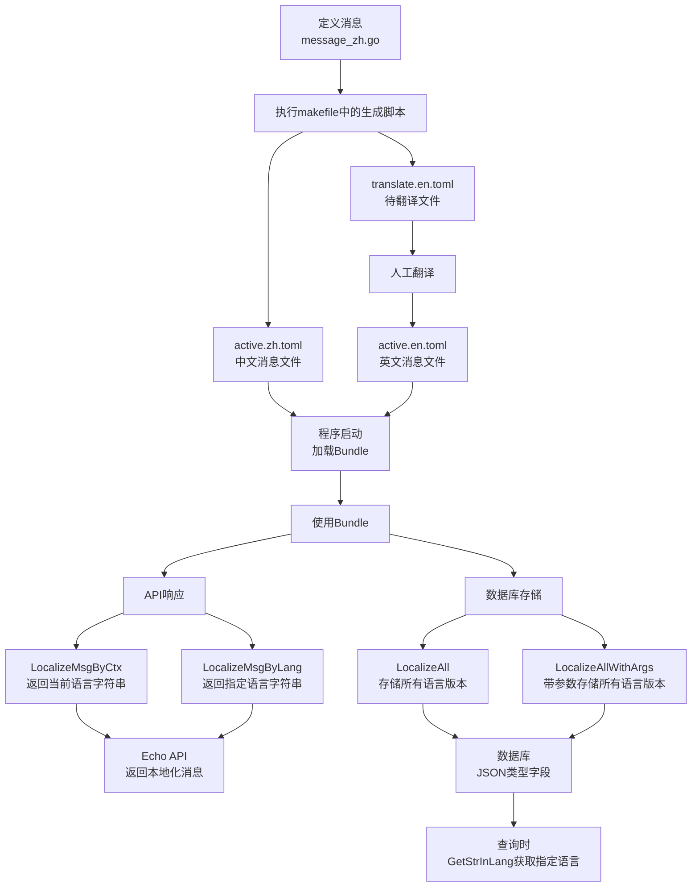

# i18nPkg 使用文档
拓展自：https://github.com/nicksnyder/go-i18n 进行了一些个性封装

## 一、功能介绍

### 1. 核心功能

#### 1.1 Bundle 初始化
```go
// 从TOML目录创建Bundle
func NewBundleFromTomlDir(fsys fs.FS, log Log) (*Bundle, error)

// 获取默认的Localizer
func (b *Bundle) DefaultLocalizer() *i18n.Localizer

// 根据语言标签获取Localizer
func (b *Bundle) GetLocalizer(tag language.Tag) *i18n.Localizer
```

#### 1.2 I18nStr 多语言字符串
```go
// I18nStr 是一个 map[language.Tag]string 类型，用于存储多语言内容
type I18nStr map[language.Tag]string

// 从单一字符串创建 I18nStr，使用默认语言
func ConvertStr2I18nAsDefaultLang(s string) I18nStr

// 从字符串 map 创建 I18nStr
func ConvertStrMap2I18nStr(s map[string]string) (I18nStr, error)

// 获取指定语言的字符串，如果不存在则返回默认语言的字符串
func (s *I18nStr) GetStrInLang(lang language.Tag) string

// 设置指定语言的字符串
func (s *I18nStr) SetStrInLang(lang language.Tag, str string)

// 转换为字符串 map
func (s *I18nStr) StrMap() map[string]string

// 复制一份新的 I18nStr
func (s *I18nStr) Copy() I18nStr

// 实现了 sql.driver.Valuer 和 sql.Scanner 接口，支持数据库存储
```

#### 1.3 消息本地化
```go
// 根据上下文进行消息本地化，返回特定语言的字符串
// 主要用于 API 接口直接返回当前语言环境的文本
func (b *Bundle) LocalizeMsgByCtx(ctx context.Context, msg *i18n.Message) string

// 根据指定语言进行消息本地化，返回特定语言的字符串
// 主要用于需要指定特定语言的 API 接口返回
func (b *Bundle) LocalizeMsgByLang(lang language.Tag, msg *i18n.Message) string

// 获取所有语言的本地化结果，返回包含所有语言版本的 I18nStr
// 主要用于需要存储到数据库的多语言内容，如审核结果、操作记录等
func (b *Bundle) LocalizeAll(msg *i18n.Message) I18nStr

// 带参数获取所有语言的本地化结果，返回包含所有语言版本的 I18nStr
// 主要用于需要存储到数据库的带参数的多语言内容
func (b *Bundle) LocalizeAllWithArgs(fmtMsg *i18n.Message, args ...any) I18nStr
```

#### 1.3 Web 中间件支持
```go
// 为Echo框架提供多语言支持的中间件，后续示例代码中默认使用该中间件，即c.Request().Context()存有语言偏好
func (b *Bundle) EchoMiddlewareByCustomFunc(getLang ...func(c echo.Context) string) echo.MiddlewareFunc
```

#### 1.3.1 中间件功能
- 支持多个语言获取函数，按优先级依次尝试
- 自动注入语言信息到请求上下文
- 与其他中间件（如JWT、权限验证等）无缝集成
- 支持自定义语言获取逻辑

#### 1.3.2 示例
```go
// 路由组配置示例
v1Router := e.Group("/v1")
v1Router.Use(
    // JWT 认证中间件
    sqleMiddleware.JWTTokenAdapter(),
    sqleMiddleware.JWTWithConfig(dmsV1.JwtSigningKey),
    // 用户状态验证
    sqleMiddleware.VerifyUserIsDisabled(),
    // 多语言支持，支持多个语言获取函数
    locale.Bundle.EchoMiddlewareByCustomFunc(
        // 1. 从当前用户配置获取语言
        dms.GetCurrentUserLanguage,
        // 2. 从 Accept-Language 头获取语言
        i18nPkg.GetLangByAcceptLanguage,
    ),
    // 其他中间件...
    sqleMiddleware.OperationLogRecord(),
)

// API 路由处理示例
v1Router.GET("/hello", func(c echo.Context) error {
    // 中间件会自动处理语言选择，直接使用 LocalizeMsgByCtx
    msg := Bundle.LocalizeMsgByCtx(c.Request().Context(), HelloMessage)
    return c.JSON(http.StatusOK, map[string]string{
        "message": msg,
    })
})
```

#### 1.3.3 语言获取优先级
1. 自定义获取函数（按传入顺序）：
    - `GetCurrentUserLanguage`：从用户配置获取
    - `GetLangByAcceptLanguage`：从请求头获取
2. 默认语言：`zh`

### 2. 数据库支持

#### 2.1 字段类型
- 使用 `json` 类型存储多语言内容
- GORM 标签：``gorm:"type:json"``
- 自动处理序列化和反序列化

#### 2.2 接口实现
```go
// Value 实现 sql.driver.Valuer 接口
func (s I18nStr) Value() (driver.Value, error) {
    b, err := json.Marshal(s)
    return string(b), err
}

// Scan 实现 sql.Scanner 接口
func (s *I18nStr) Scan(input interface{}) error {
    if input == nil {
        return nil
    }
    if data, ok := input.([]byte); !ok {
        return fmt.Errorf("I18nStr Scan input is not bytes")
    } else {
        return json.Unmarshal(data, s)
    }
}
```

## 二、项目实践

### 1. 基础配置

```go
package main

import (
    "embed"
    "github.com/actiontech/dms/pkg/dms-common/i18nPkg"
)

//go:embed active.*.toml
var localeFS embed.FS

var Bundle *i18nPkg.Bundle

func init() {
    b, err := i18nPkg.NewBundleFromTomlDir(localeFS, log.NewEntry())
    if err != nil {
        panic(err)
    }
    Bundle = b
}
```

### 2. 开发流程

#### 2.1 定义翻译消息
```go
// message_zh.go
var (
    // 简单消息
    HelloMessage = &i18n.Message{
        ID: "hello",
        Other: "你好",
    }
    
    // 使用 fmt 占位符的消息
    DefaultTemplatesDesc = &i18n.Message{
        ID: "DefaultTemplatesDesc",
        Other: "%s 默认模板",
    }

    // 多参数消息示例
    OprExecutingWorkflowWithNameAndDB = &i18n.Message{
        ID: "OprExecutingWorkflowWithNameAndDB",
        Other: "上线工单的单个数据源, 工单名称：%v, 数据源名: %v",
    }
)
```

#### 2.2 生成翻译文件
相关脚本在项目根目录makefile中
```bash
make install_i18n_tool # 安装相关工具，已安装可跳过
make extract_i18n      # 提取 message_zh.go 新增消息到 active.zh.toml
make start_trans_i18n  # 生成待翻译的英文条目到 translate.en.toml
# ... 进行翻译工作 ...
make end_trans_i18n    # 合并翻译结果到 active.en.toml
```

### 3. 使用场景

#### 3.1 API 接口返回的文本支持国际化
```go
func GetHello(c echo.Context) error {
    msg := Bundle.LocalizeMsgByCtx(c.Request().Context(), HelloMessage)
    return c.JSON(http.StatusOK, map[string]string{
        "message": msg,
    })
}
```

#### 3.2 数据库存储的文本支持国际化
```go
// 定义模型
type AuditResult struct {
    gorm.Model
    TaskID      uint            `gorm:"column:task_id;type:int unsigned;not null"`
    Result      i18nPkg.I18nStr `gorm:"column:result;type:json"`
    Level       string          `gorm:"column:level;type:varchar(16);not null"`
    RuleName    string          `gorm:"column:rule_name;type:varchar(64);not null"`
}

// 存储审核结果
func SaveAuditResult(db *gorm.DB, taskID uint, ruleName string) error {
    // 获取所有语言版本的审核结果
    // 使用 LocalizeAllWithArgs 支持参数替换
    result := Bundle.LocalizeAllWithArgs(SQLAuditResultDescPass, ruleName)
    
    return db.Create(&AuditResult{
        TaskID:   taskID,
        Result:   result,
        Level:    "error",
        RuleName: ruleName,
    }).Error
}

// 查询审核结果，可能触发多条规则会有多个审核结果
func GetAuditResults(ctx context.Context, db *gorm.DB, taskID uint) ([]string, error) {
    var results []AuditResult
    if err := db.Where("task_id = ?", taskID).Find(&results).Error; err != nil {
        return nil, err
    }
    
    // 获取当前语言环境
    lang := locale.Bundle.GetLangTagFromCtx(ctx)
    
    // 获取指定语言的审核结果
    var messages []string
    for _, r := range results {
        msg := r.Result.GetStrInLang(lang)
        if msg != "" {
            messages = append(messages, msg)
        }
    }
    return messages, nil
}

// 使用示例
func ExampleUsage(db *gorm.DB, ctx context.Context) error {
    // 存储审核结果
    if err := SaveAuditResult(db, 12345, "rule_syntax_check"); err != nil {
        return err
    }
    
    // 查询审核结果（会根据上下文自动选择语言）
    results, err := GetAuditResults(ctx, db, 12345)
    if err != nil {
        return err
    }
    
    // 打印所有审核结果
    for _, msg := range results {
        fmt.Println(msg)
    }
    return nil
}
```

### 4. 流程展示



### 5. 最佳实践

#### 5.1 开发规范
- 所有翻译消息统一在 `message_zh.go` 中定义
- 使用 fmt 占位符（如 `%s`、`%v`）进行参数替换
- 消息ID能体现用途和含义并保证唯一
- Bundle 实例在应用程序生命周期内保持单例

#### 5.2 质量保证
- 确保所有消息都有完整的中英文翻译
- 检查参数占位符的数量和类型是否匹配
- 清理未使用的翻译条目
- 保持翻译术语的一致性
